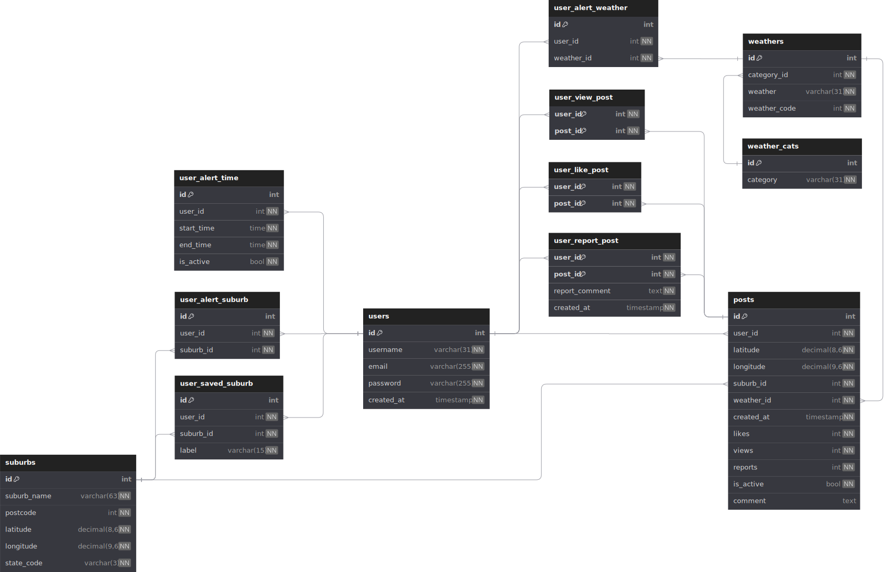

# Pixel Weather Backend API Documentation

[Read the documentation clicking here.](https://leung-hiufung.github.io/pixelweather)

Or copy link to browser:

https://leung-hiufung.github.io/pixelweather

## Database structure

### Notable Unique Key

- **users**: email
- **suburbs**: (suburb_name, postcode)
- **user_alert_time**:(user_id, start_time, end_time)
- **weathers**: (weather, weather_code)
- **user_alert_weather**: (user_id, weather_id)
- **user_alert_suburb**: (user_id, suburb_id)
- **user_saved_suburb**: (user_id, label)

